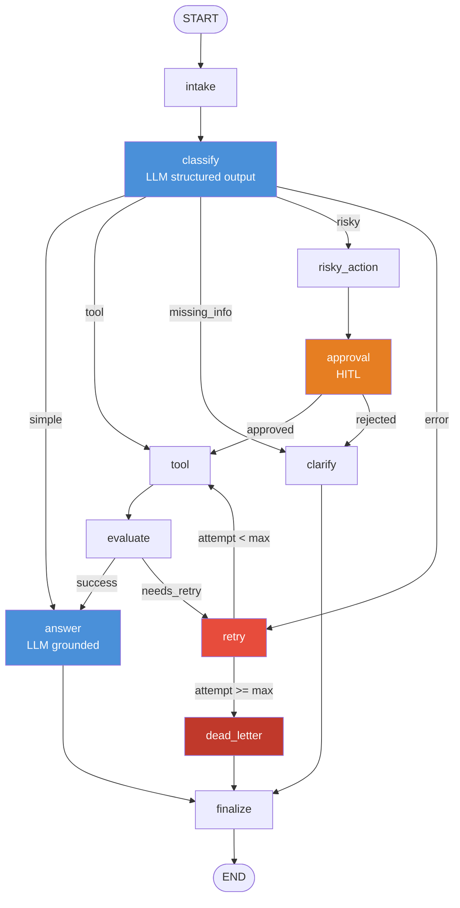

# Day 08 — LangGraph Agentic Orchestration

> **Student:** Đặng Thị Thu Thảo · 2A202600685  
> **Course:** VinUniversity · AI Competency Bootcamp · Phase 2 · Track 3 · Week 5

---

## What this is

A production-style **support-ticket triage agent** built with [LangGraph](https://langchain-ai.github.io/langgraph/).  
The agent classifies incoming queries with an LLM and routes them through a stateful graph that handles:

- Simple FAQ answers
- Tool lookups (order status, account data)
- Missing-information clarification
- Risky/destructive actions with human-in-the-loop approval
- Transient errors with bounded retry + dead-letter escalation

---

## Architecture

```
START → intake → classify (LLM) → route
  simple       → answer (LLM) → finalize → END
  tool         → tool → evaluate → answer → finalize → END
  tool (retry) → tool → evaluate → retry (loop) → … → finalize → END
  missing_info → clarify → finalize → END
  risky        → risky_action → approval (HITL) → tool → … → finalize → END
  error        → retry → tool → evaluate → retry (loop) → finalize → END
  (max retry)  → dead_letter → finalize → END
```



---

## Quick Start

### 1. Prerequisites

- Python 3.11+
- An OpenAI API key (or Gemini / Anthropic)

### 2. Install

```bash
pip install -e ".[dev,openai]"
# or for Gemini:  pip install -e ".[dev,google]"
# or for Claude:  pip install -e ".[dev,anthropic]"
```

### 3. Configure

```bash
cp .env.example .env
# Edit .env — set OPENAI_API_KEY=sk-...
```

Optional: enable LangSmith tracing by also setting:
```
LANGCHAIN_TRACING_V2=true
LANGCHAIN_API_KEY=lsv2_...
LANGCHAIN_PROJECT=day08-langgraph-lab
```

### 4. Run tests

```bash
make test          # unit tests (no LLM needed)
```

### 5. Run scenarios & generate report

```bash
make run-scenarios   # → outputs/metrics.json + reports/lab_report.md
make grade-local     # validate metrics schema
```

### 6. Launch UI

```bash
pip install streamlit
streamlit run src/langgraph_agent_lab/app.py
```

The Streamlit app lets you:
- Run individual queries interactively and see node-by-node event logs
- Run all scenarios and view a live metrics dashboard
- Browse the graph architecture diagram

---

## Project Structure

```
.
├── configs/
│   ├── lab.yaml              # scenarios path, checkpointer, report path
│   └── grading.yaml
├── data/sample/
│   └── scenarios.jsonl       # 15 test scenarios (6 required + 9 complex)
├── docs/
│   ├── LAB_GUIDE.md          # step-by-step implementation guide
│   ├── METRICS.md            # metrics schema specification
│   └── RUBRIC.md             # grading rubric
├── outputs/
│   └── metrics.json          # generated after make run-scenarios
├── reports/
│   ├── lab_report_template.md
│   └── lab_report.md         # generated after make run-scenarios
├── src/langgraph_agent_lab/
│   ├── state.py              # AgentState TypedDict + reducers
│   ├── nodes.py              # 11 node functions (classify + answer use LLM)
│   ├── routing.py            # 4 conditional edge routing functions
│   ├── graph.py              # StateGraph wiring + compile
│   ├── persistence.py        # MemorySaver / SQLite checkpointer
│   ├── llm.py                # LLM factory + LangSmith config
│   ├── metrics.py            # MetricsReport schema + helpers
│   ├── scenarios.py          # scenario loader
│   ├── report.py             # Markdown report renderer
│   ├── cli.py                # Typer CLI (run-scenarios, validate-metrics)
│   └── app.py                # Streamlit UI
└── tests/
    ├── test_state.py
    ├── test_routing.py
    ├── test_metrics.py
    └── test_graph_smoke.py   # requires LLM key
```

---

## Scenarios

15 test scenarios covering all routes:

| ID | Query (truncated) | Route | Approval? |
|---|---|---|---|
| S01 | How do I reset my password? | simple | No |
| S02 | Lookup order status #12345 | tool | No |
| S03 | Can you fix it? | missing_info | No |
| S04 | Refund customer + send email | risky | **Yes** |
| S05 | Timeout failure while processing | error (retry) | No |
| S06 | Delete customer account | risky | **Yes** |
| S07 | System failure (max_attempts=1) | error → dead_letter | No |
| S08 | Complex order status + ETA | tool | No |
| S09 | Full refund + cancel + apology voucher | risky | **Yes** |
| S10 | Fix the billing problem | risky | **Yes** |
| S11 | Connection timeout upstream service | error (retry) | No |
| S12 | Return policy question | simple | No |
| S13 | Suspend + delete + notify compliance | risky | **Yes** |
| S14 | Where is my package? | tool | No |
| S15 | Payment gateway unreachable (max_attempts=1) | error → dead_letter | No |

---

## Key Design Decisions

**Why LangGraph over LCEL?**  
LCEL chains are linear — no branching, no loops, no human approval, no crash-resume.
LangGraph's `StateGraph` provides typed state, conditional edges, and checkpointing,
which are all required for production agents.

**Bounded retry loop**  
`retry_or_fallback_node` increments `attempt`; `route_after_retry` caps the loop at
`max_attempts`, routing to `dead_letter` on overflow. No unbounded loops.

**Append vs overwrite reducers**  
Fields that accumulate across nodes (`messages`, `tool_results`, `errors`, `events`)
use `Annotated[list, add]`. Single-value fields use Python's default overwrite.

**LangSmith tracing**  
Every LLM call is automatically traced when `LANGCHAIN_TRACING_V2=true`.
Traces include the full node execution path, token counts, and latency per call.

---

## Grading Checklist

- [x] Typed state with correct reducers
- [x] All 11 nodes implemented
- [x] `classify_node` uses real LLM (structured output)
- [x] `answer_node` uses real LLM (grounded response)
- [x] Correct routing for all 6+ scenarios
- [x] Bounded retry loop (max_attempts guard)
- [x] HITL approval path
- [x] All paths terminate at `finalize → END`
- [x] Checkpointer wired (MemorySaver default, SQLite extension)
- [x] `outputs/metrics.json` valid schema
- [x] `reports/lab_report.md` with diagram + failure analysis
- [x] LangSmith tracing support
- [x] Streamlit UI

---

## References

- [LangGraph docs](https://langchain-ai.github.io/langgraph/)
- [LangGraph persistence](https://langchain-ai.github.io/langgraph/how-tos/persistence/)
- [LangSmith](https://smith.langchain.com)
- [OpenAI API](https://platform.openai.com/docs)
