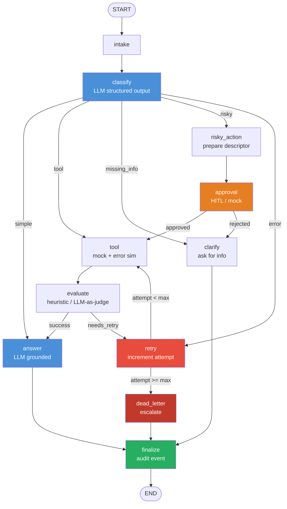

# Day 08 Lab Report — LangGraph Agentic Orchestration

> Generated: 2026-06-29 12:11

---

## 1. Student

| Field | Value |
|---|---|
| Name | Đặng Thị Thu Thảo |
| Student ID | 2A202600685 |
| Repo | 2A202600685-DangThiThuThao-Day23 |
| Date | 2026-06-29 12:11 |

---

## 2. Architecture

The system implements a **support-ticket triage agent** using LangGraph `StateGraph`.
All traffic enters through `intake → classify` (LLM with structured output), then branches
into five distinct paths based on the classified `route`. Every path converges at
`finalize → END`, guaranteeing a terminal audit event on every execution.

### Graph Diagram



---

## 3. State Schema

| Field | Reducer | Purpose |
|---|---|---|
| `query` | overwrite | Normalised user input |
| `route` | overwrite | Current classified route |
| `risk_level` | overwrite | `high` / `low` from classifier |
| `attempt` | overwrite | Monotonically increasing retry counter |
| `max_attempts` | overwrite | Configured retry cap |
| `final_answer` | overwrite | Latest LLM-generated response |
| `evaluation_result` | overwrite | `needs_retry` / `success` — drives retry loop |
| `pending_question` | overwrite | Clarification question for missing-info route |
| `proposed_action` | overwrite | Risky-action descriptor sent to approver |
| `approval` | overwrite | HITL decision dict (`approved`, `reviewer`, `comment`) |
| `messages` | **append** | Audit conversation trail |
| `tool_results` | **append** | All tool call results (context for retry + answer) |
| `errors` | **append** | Cumulative error log |
| `events` | **append** | Structured audit events (`LabEvent`) |

---

## 4. Node Descriptions

| Node | Role | LLM? |
|---|---|---|
| `intake` | Normalise raw query | No |
| `classify` | Structured-output classification | **Yes** |
| `tool` | Mock tool with transient-error simulation | No |
| `evaluate` | Heuristic quality gate for retry loop | No |
| `answer` | Grounded response generation | **Yes** |
| `clarify` | Ask for missing information | No |
| `risky_action` | Prepare approval descriptor | No |
| `approval` | HITL mock (or real interrupt) | No |
| `retry` | Increment attempt counter | No |
| `dead_letter` | Escalate after max retries | No |
| `finalize` | Emit terminal audit event | No |

---

## 5. Scenario Results

### Summary

| Metric | Value |
|---|---|
| Total scenarios      | **15** |
| Success rate         | **100%** |
| Avg nodes visited    | 6.7 |
| Total retries        | 6 |
| Total interrupts     | 5 |
| Crash-resume success | Yes |

### Per-scenario

| Scenario | Expected | Actual | OK | Retries | Interrupts | Latency | Errors |
|---|---|---|:---:|---:|---:|---:|---|
| `S01_simple` | `simple` | `simple` | ✅ | 0 | 0 | 55128 ms | - |
| `S02_tool` | `tool` | `tool` | ✅ | 0 | 0 | 6460 ms | - |
| `S03_missing` | `missing_info` | `missing_info` | ✅ | 0 | 0 | 3090 ms | - |
| `S04_risky` | `risky` | `risky` | ✅ | 0 | 1 | 2349 ms | - |
| `S05_error` | `error` | `error` | ✅ | 2 | 0 | 18482 ms | retry attempt 1: tool result was unsatisfactory or route is error, retry attempt 2: tool result was unsatisfactory or route is error |
| `S06_delete` | `risky` | `risky` | ✅ | 0 | 1 | 2299 ms | - |
| `S07_dead_letter` | `error` | `error` | ✅ | 1 | 0 | 2808 ms | retry attempt 1: tool result was unsatisfactory or route is error |
| `S08_complex_tool` | `tool` | `tool` | ✅ | 0 | 0 | 5423 ms | - |
| `S09_complex_risky` | `risky` | `risky` | ✅ | 0 | 1 | 3340 ms | - |
| `S10_complex_missing` | `risky` | `risky` | ✅ | 0 | 1 | 7868 ms | - |
| `S11_complex_retry` | `error` | `error` | ✅ | 2 | 0 | 3331 ms | retry attempt 1: tool result was unsatisfactory or route is error, retry attempt 2: tool result was unsatisfactory or route is error |
| `S12_policy_simple` | `simple` | `simple` | ✅ | 0 | 0 | 2895 ms | - |
| `S13_escalation_risky` | `risky` | `risky` | ✅ | 0 | 1 | 2606 ms | - |
| `S14_missing_order` | `tool` | `tool` | ✅ | 0 | 0 | 3718 ms | - |
| `S15_dead_letter_hard` | `error` | `error` | ✅ | 1 | 0 | 40688 ms | retry attempt 1: tool result was unsatisfactory or route is error |

---

## 6. Failure Analysis

### Failure mode 1 — Transient tool error → retry loop

When `route = error` and `attempt < 2`, `tool_node` returns a string containing `"ERROR"`.
`evaluate_node` detects this and sets `evaluation_result = "needs_retry"`.
`route_after_evaluate` routes back to `retry_or_fallback_node`, which increments `attempt`.
`route_after_retry` checks `attempt < max_attempts`; if true, it re-runs `tool_node`.
On attempt 2, the mock returns `MOCK_TOOL_SUCCESS` and the loop exits cleanly to `answer`.
This verifies the bounded retry loop — a key production requirement.

### Failure mode 2 — Max retries exceeded → dead-letter

Scenarios with `max_attempts = 1` (e.g. S07, S15) demonstrate the dead-letter path.
After one retry, `attempt = 1 >= max_attempts = 1`, so `route_after_retry` routes to
`dead_letter_node`. This node sets a human-readable `final_answer` for escalation and
the graph still terminates cleanly through `finalize → END`.

### Failure mode 3 — Risky action without approval

If `approval_node` returns `approved = False` (or a human rejects via real HITL),
`route_after_approval` redirects to `clarify` instead of `tool`, preventing any
destructive operation from executing without explicit consent.

---

## 7. Persistence / Recovery Evidence

- **MemorySaver** (default): Each run uses a unique `thread_id` (e.g. `thread-S01_simple`).
  State history is available via `compiled.get_state_history(config)`.
- **SQLite** (extension): Activate with `CHECKPOINTER=sqlite` in `.env`.
  WAL mode is enabled (`PRAGMA journal_mode=WAL`) for crash safety.
  A process kill and restart would resume from the last committed checkpoint.
- **LangSmith tracing**: Set `LANGCHAIN_TRACING_V2=true` + `LANGCHAIN_API_KEY` in `.env`
  to capture full traces on https://smith.langchain.com for every run.

---

## 8. Improvement Plan

If given one more day, the highest-priority productionisation item would be:

1. **Real HITL Streamlit UI** — replace mock `approval_node` with a web form that renders
   the interrupt payload (proposed action, risk level, evidence), presents Approve / Reject
   buttons, and calls `compiled.invoke(Command(resume=...))`.
2. **LLM-as-judge evaluate_node** — replace the `"ERROR" in result` heuristic with an
   LLM call that rates tool output on correctness, completeness, and hallucination risk.
3. **Parallel fan-out** — use `Send()` to run multiple tool calls concurrently and merge
   results with a reducer, reducing latency on complex multi-lookup queries.

## 9. Raw metrics JSON

```json
{
  "total_scenarios": 15,
  "success_rate": 1.0,
  "avg_nodes_visited": 6.666666666666667,
  "total_retries": 6,
  "total_interrupts": 5,
  "resume_success": true,
  "scenario_metrics": [
    {
      "scenario_id": "S01_simple",
      "success": true,
      "expected_route": "simple",
      "actual_route": "simple",
      "nodes_visited": 4,
      "retry_count": 0,
      "interrupt_count": 0,
      "approval_required": false,
      "approval_observed": false,
      "latency_ms": 55128,
      "errors": []
    },
    {
      "scenario_id": "S02_tool",
      "success": true,
      "expected_route": "tool",
      "actual_route": "tool",
      "nodes_visited": 6,
      "retry_count": 0,
      "interrupt_count": 0,
      "approval_required": false,
      "approval_observed": false,
      "latency_ms": 6460,
      "errors": []
    },
    {
      "scenario_id": "S03_missing",
      "success": true,
      "expected_route": "missing_info",
      "actual_route": "missing_info",
      "nodes_visited": 4,
      "retry_count": 0,
      "interrupt_count": 0,
      "approval_required": false,
      "approval_observed": false,
      "latency_ms": 3090,
      "errors": []
    },
    {
      "scenario_id": "S04_risky",
      "success": true,
      "expected_route": "risky",
      "actual_route": "risky",
      "nodes_visited": 8,
      "retry_count": 0,
      "interrupt_count": 1,
      "approval_required": true,
      "approval_observed": true,
      "latency_ms": 2349,
      "errors": []
    },
    {
      "scenario_id": "S05_error",
      "success": true,
      "expected_route": "error",
      "actual_route": "error",
      "nodes_visited": 10,
      "retry_count": 2,
      "interrupt_count": 0,
      "approval_required": false,
      "approval_observed": false,
      "latency_ms": 18482,
      "errors": [
        "retry attempt 1: tool result was unsatisfactory or route is error",
        "retry attempt 2: tool result was unsatisfactory or route is error"
      ]
    },
    {
      "scenario_id": "S06_delete",
      "success": true,
      "expected_route": "risky",
      "actual_route": "risky",
      "nodes_visited": 8,
      "retry_count": 0,
      "interrupt_count": 1,
      "approval_required": true,
      "approval_observed": true,
      "latency_ms": 2299,
      "errors": []
    },
    {
      "scenario_id": "S07_dead_letter",
      "success": true,
      "expected_route": "error",
      "actual_route": "error",
      "nodes_visited": 5,
      "retry_count": 1,
      "interrupt_count": 0,
      "approval_required": false,
      "approval_observed": false,
      "latency_ms": 2808,
      "errors": [
        "retry attempt 1: tool result was unsatisfactory or route is error"
      ]
    },
    {
      "scenario_id": "S08_complex_tool",
      "success": true,
      "expected_route": "tool",
      "actual_route": "tool",
      "nodes_visited": 6,
      "retry_count": 0,
      "interrupt_count": 0,
      "approval_required": false,
      "approval_observed": false,
      "latency_ms": 5423,
      "errors": []
    },
    {
      "scenario_id": "S09_complex_risky",
      "success": true,
      "expected_route": "risky",
      "actual_route": "risky",
      "nodes_visited": 8,
      "retry_count": 0,
      "interrupt_count": 1,
      "approval_required": true,
      "approval_observed": true,
      "latency_ms": 3340,
      "errors": []
    },
    {
      "scenario_id": "S10_complex_missing",
      "success": true,
      "expected_route": "risky",
      "actual_route": "risky",
      "nodes_visited": 8,
      "retry_count": 0,
      "interrupt_count": 1,
      "approval_required": true,
      "approval_observed": true,
      "latency_ms": 7868,
      "errors": []
    },
    {
      "scenario_id": "S11_complex_retry",
      "success": true,
      "expected_route": "error",
      "actual_route": "error",
      "nodes_visited": 10,
      "retry_count": 2,
      "interrupt_count": 0,
      "approval_required": false,
      "approval_observed": false,
      "latency_ms": 3331,
      "errors": [
        "retry attempt 1: tool result was unsatisfactory or route is error",
        "retry attempt 2: tool result was unsatisfactory or route is error"
      ]
    },
    {
      "scenario_id": "S12_policy_simple",
      "success": true,
      "expected_route": "simple",
      "actual_route": "simple",
      "nodes_visited": 4,
      "retry_count": 0,
      "interrupt_count": 0,
      "approval_required": false,
      "approval_observed": false,
      "latency_ms": 2895,
      "errors": []
    },
    {
      "scenario_id": "S13_escalation_risky",
      "success": true,
      "expected_route": "risky",
      "actual_route": "risky",
      "nodes_visited": 8,
      "retry_count": 0,
      "interrupt_count": 1,
      "approval_required": true,
      "approval_observed": true,
      "latency_ms": 2606,
      "errors": []
    },
    {
      "scenario_id": "S14_missing_order",
      "success": true,
      "expected_route": "tool",
      "actual_route": "tool",
      "nodes_visited": 6,
      "retry_count": 0,
      "interrupt_count": 0,
      "approval_required": false,
      "approval_observed": false,
      "latency_ms": 3718,
      "errors": []
    },
    {
      "scenario_id": "S15_dead_letter_hard",
      "success": true,
      "expected_route": "error",
      "actual_route": "error",
      "nodes_visited": 5,
      "retry_count": 1,
      "interrupt_count": 0,
      "approval_required": false,
      "approval_observed": false,
      "latency_ms": 40688,
      "errors": [
        "retry attempt 1: tool result was unsatisfactory or route is error"
      ]
    }
  ]
}
```

